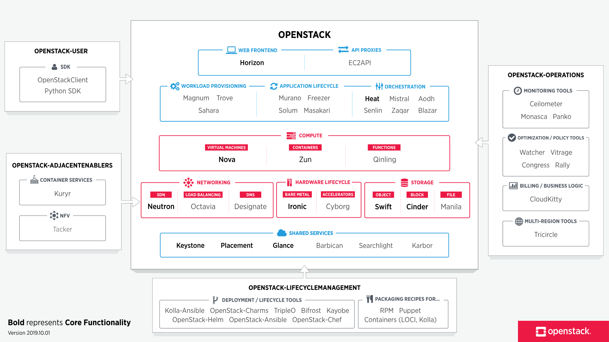

# Présentation Modules

OpenStack est basé sur une architecture modulaire. Chaque module communique entre eux via des API. Certains peuvent avoir un rôle fonctionnel au seins d'OpenStack (_ex_ : authentification, gestion réseaux, facturation), et d'autre peuvent également interagir avec des logicielles (_ex_ : Nova interagit avec VirtualBox).

_Vocabulaire_ : les **core modules** sont les modules définis comme essentiel. Historiquement ce sont les premiers modules qui sont apparus, sans lequel OpenStack ne pourra pas fonctionner. Au cours du développement ce terme est devenu plus flous.

[//]: <> (src image : https://www.openstack.org/software/)


Ici seront présenté les modules dans l'ordre d'apparition selon une architecture simple et minimaliste.

```
  Horizon
    |
    |
    |       Neutron   Cinder    Nova    Glance    Swift
    |       |         |         |       |         |
    |       |         |         |       |         |
    |       |         |         |       |         |
  Keystone─────────────────────────────────────────────────Ceilometer
```

## [Keystone](https://docs.openstack.org/keystone/latest/getting-started/architecture.html)
|catégorie  		|fonction							|
|---				|---								|
|service partagé	|identification						|

Ce module est utilisé pour l'authentification, c'est la première étape de l'utilisateur.

De manière résumé Keystone fonctionne comme un Active Directory ou Kerberos. En effet l'utilisateur rentre ses identifiants. Une fois validé, un `token` (jeton) lui ait donné. Ce `token` se présente sous la forme d'une requête POST JSON (système d'API). Il n'est valide que temporairement. Dès que l'utilisateur demande l'accès à un modules, il y envoie son `token`. Du coté du module contacté, il valide ou non le `token`. La validité temporaire de ce jeton trouve son intérêt dans l'aspect de sécurité. En effet si une interception du `token` est effectué alors il ne sera valide que pendant un cours instant.

### Implémentation
Plusieurs méthodes d'authentification plug-n-play sont disponibles :
- username / password / token (celle de base de Keystone)
- OAuth
- Apache REMOTE_USER (docs [OpenStack](https://docs.openstack.org/keystone/pike/advanced-topics/external-auth.html))
- LDAP (docs [ubuntu](https://ubuntu.com/kubernetes/docs/ldap) ─ [OpenStack](https://docs.openstack.org/keystone/pike/admin/identity-integrate-with-ldap.html))
- Kerberos (docs [Objectif Libre (une entreprise officielle dev d'OpenStack)](https://www.objectif-libre.com/en/blog/2018/02/26/kerberos-authentication-for-keystone/))  


### Type Token

Il existe [deux types de `token`](https://docs.openstack.org/keystone/pike/admin/identity-tokens.html):

- **UUID** : utilisé par défaut, il possède une taille de 256 bits. Chaque `token` est enregistré sur un serveur SQL en back end **de manière persistante**. L'aspect indésirable est l'accumulation de donné sur la base SQL en question. Pour purger les `token` inutilisables, exécuté `keystone-manage token_flush` dans un `cron`
- [**Fernet**](https://cryptography.io/en/latest/fernet/) : l'utilisation des `token` n'est pas persistante, autrement dit sur la base ne resident que des jetons temporaires. Les donnés du `token` sont crypté avec l'`AES256` est leur intégrité est vérifié par signature `SHA256 HMAC`. Basée sur un systeme cryptographique, Fernet effectue une rotation en continue definit par une période pour ainsi garantir une meilleure sécurité. Fernet possède un `key_repository`, un repertoire dans lequel sont stockés trois clefs :
	- *Primary key* clef active AES.
	- *Secondary key* ancienne clef active, utilisée pour les decryptions de packets crées peut de temps après la rotation de clefs.
	- *Staged key* la prochaine clef active.  

En bref, Fernet garantie une meilleur **scalability**.

### Identification
Le fonctionnement de l'identification se comporte de tel manière : les `users` appartiennent à un `groups` qui appartient à un `domain`. Les `projects` appartiennent à un `domains`.
Les ressources sont définis lors de la definition du `project` et de `domain`

### Role
Le rôle définit le niveau d'autorisation, il existe les rôles suivants :
- `admin` qui est le super utilisateur de tout l'ensemble OpenStack
- `_member_` un utilisateur lambda avec peu de droits
- d'autre rôle peuvent être créer notement en tant que Operateur d'un module (ex: SwiftOperator)

## Nova
|catégorie  		|fonction							|
|---				|---								|
|calcul				|gestion de l'hyperviseur			|

Est le module qui prépare la machine virtuelle et qui gère l'hyperviseur. Au niveau de l'**architecture** Nova communique en REST API pour l'interface utilisateur (cli, horizon, ...) ce qui utilise la base de donné partagée avec les autres modules, mais pour les communications internes Nova utilise les appels [RPC](https://docs.openstack.org/nova/latest/reference/rpc.html). Nova possède la fonctionnalité du déploiement horizontal, nommé [Cells](https://docs.openstack.org/nova/latest/user/cells.html).

|[hyperviseur compatible avec nova](https://docs.openstack.org/nova/train/admin/configuration/hypervisors.html)	|
|			:---:					|
|**type natif** 					|
|[KVM](https://docs.openstack.org/nova/train/admin/configuration/hypervisor-kvm.html)							|
|[Xen (libvirt)](https://docs.openstack.org/nova/train/admin/configuration/hypervisor-xen-libvirt.html)			|
|[LXC (libvirt) (déprécié en prod)](https://docs.openstack.org/nova/train/admin/configuration/hypervisor-lxc.html)							|
|HyperV								|
|zVM								|
|**type hosted**					|
|[QEMU](https://docs.openstack.org/nova/train/admin/configuration/hypervisor-qemu.html)							|
|**bare-metal**	(execution sur machine physique)|
|Ironic (module d'OpenStack)		|

Pour choisir un hyperviseur, veillez consulter [ce tableau qui traite sur les différentes features que gère chaque hyperviseur](https://docs.openstack.org/nova/ussuri/user/feature-classification.html#matrix-gp). 

**À propos de LXC**. LXC embarque libvirt depuis peu, mais il n'est pas sécurisé pour la multi-collocation.  
**À propos de libvirt**. Il est important de vérifier les failles de sécurité de libvirt, si utilisé, car il peut fortement impacté la conteneurisation. *Voir [CVE-2019-5736](https://blog.dragonsector.pl/2019/02/cve-2019-5736-escape-from-docker-and.html) : s'echaper du conteneur via les PID.*

> **Attention** il est important de noter que la migration des instances entre les *compute nodes* n'est pas encore supporté (version Ussuri). [voir ici](https://docs.openstack.org/nova/ussuri/user/cellsv2-layout.html#cross-cell-instance-migrations)

Des option avancé sont [disponible](https://docs.openstack.org/nova/ussuri/admin/index.html) comme l'utilisation de GPU, securisation, topologie CPU....

### Organisation

Nova est organisé de la sorte :
- `nova-api` gère les REST API exterieur de nova, autement dit gère les interractionavec les autres modules et les utilisateurs.
- `nova-scheduler` et `placement` sont les services responsablent du tracking des ressources et des decision d'execution.
- *API database* utilisé par `nova-api` et `nova-scheduler`, conserve des information concernant les instances comme la location (sur quel compute node est executé telle instance) et les instances futures. 
- `nova-conductor` 
- `nova-compute` gère les *virt driver* et les hyperviseur.
- *cell database* est utilisée par l'API, le *nova-conductor* et *nova-compute*, enregistre la major partie des informations à propos des instances.
- *cell0 database* gère que les instance qui échoue lors d'allocation de ressources.
- *message queue* permet la communication au sein de nova via RPC.

## Placement
|catégorie  		|fonction							|
|---				|---								|
|service partagé	|allocation de ressources			|


Placement est un module extrait de **Nova** depuis la version Stein. Il est definit comme un core module. En effet, son rôle premier est l'allocation en tout genre que ce soit cpu, memoire, espace de stockage, ou même ip.

## Glance
|catégorie  		|fonction							|
|---				|---								|
|service partagé	|management d'image pour VM			|

Ce module à pour principal objectif de charger une image base sur une VM. Glance ne stock pas les images; les images peuvent être stocké simplement sur le `filesystem` ou via Swift (module détaillé plus bas). Des images pre-built officielles sont [disponnible](https://docs.openstack.org/image-guide/obtain-images.html).

| OS/distribution 		|  lien | login |
|-----------------		|-------|-------|
|CentOS				| [6](http://cloud.centos.org/centos/6/images/)|centos|
|					| [7](http://cloud.centos.org/centos/7/images/)|centos|
|Debian				| [current](http://cdimage.debian.org/cdimage/openstack/)|debian|
|Fedora				| [latest](https://alt.fedoraproject.org/cloud/)		|fedora|
|Ubuntu				| [bionic](https://cloud-images.ubuntu.com/bionic/current/bionic-server-cloudimg-amd64.img)|ubuntu|
|Suse				| [JeOS](https://software.opensuse.org/distributions/leap#JeOS-ports)|opensuse|
|RedHat				| [RHEL 7 KVM](https://access.redhat.com/downloads/content/69/ver=/rhel---7/x86_64/product-downloads)|cloud-user|
|Windows			| [Cloud](https://cloudbase.it/windows-cloud-images/)||
|CirrOS				|	| (user cirros ; pass gocubsgo) |


> **Attention** une des images de base proposé est CirrOS. **Il ne doit pas être utilisé en prod pour des raison de sécurité.** Uniquement utilisé en test car sa taille est très légère 12.7 MB.

Glance a besoin d'acceder à une base de données pour y stocké toutes les metadata concernant l'utilisation de ses images. 

> **NOTE sur Glance (Ussuri)** Due à un [bug SSL sur python 3](https://bugs.launchpad.net/glance/+bug/1482633), la version stable de Glance s'execute en python 2.7.

## Neutron

|catégorie  		|fonction							|
|---				|---								|
|réseaux			|software-defined networking (SDN)	|

Neutron est responsable de la définition du réseaux pour les VM. Il leur assigne une IP. Mais également il peut gérer les connexion entres les VM. Neutron est aussi spécialisé dans le VPNaaS, FWaaS (FireWall-as-a-Service), et le LBaaS (LoadBalancing-as-a-Service). Il fonctionne sur du SDN (software-defined networking), utilisé en milieu de cloud-computing, il tend à séparer le trafic réseaux en trois couche :
- management plane : interface utilisateur pour la gestion
- controle plane : protocole de routage et décision du traitement
- data plane : traitement des paquets

[//]: <> (src image : https://fr.wikipedia.org/wiki/Software-defined_networking#/media/Fichier:Software_Defined_Networking_System_Overview.fr.svg)
[//]: <> (../../annexe/assets/SDN.png)


### Composition
Neutron s'organise en plusieurs composants : 
- `neutron-server` acccepte et route les requette API au bon Network plug-in.
- **Openstack networking plug-in agent** permet la creation des `networks` et `subnets`, des plu et unplug les ports. les agents varient en fonction de la methode utilisé linux bridges, Open vSwitch, OVN... Les agents les plus communs sont L3, DHCP.
- *Message queue* permet la communication entre `neutron-server` et plusieurs autres agents. Egalement peut être utilisé comme database pour enregistrer l'etat du réseau.

### Architecture
**NETWORK** est comparable à un réseaux VLAN dans les réseaux classiques mais avec plus de flexibilité. Le VLAN est une logique de découpage qui permet notamment de séparer deux différent VLAN se trouvant sur le même réseaux. Chaque réseaux VLAN à son domaine de broadcast d'associé. De manière similaire les NETWORK sous OpenStack associé un broadcast à chaque réseaux.  
La séparation des NETWORKS est appelé **méthode de segmentation**. OpenStack embarque avec lui plusieurs méthode comme :
- VLAN
- [VXLAN](https://tools.ietf.org/html/rfc7348) même principe que VLAN; avec 16 millions d'adresse possible
- GRE
- Network Namespaces
- OpenFlow Rules

Lorsqu'un NETWORK est crée alors un **SUBNET** lui est automatiquement associé. Le SUBNET est une couche qui definit les adressages des VM présent sur le NETWORK. Par défaut un server DHCP est lancé, mangé par l'agent dhcp de Neutron.
Une fois le NETWORK spécifié des VM peuvent être créer par le module Nova.  

Les **Ports** au seins du réseaux différent des ports classiques. Ici un Port est associé à un service du serveur. En effet il se presente sous cette forme : 

|  			|Name 		| Fixed IP	|Attached Device	 		| Status 	|
|---		|---		|---		|---						|---		|
|**format**	|hash		|IPv4		|ex: network:dhcp 			| Active/Inactive|


Pour connecter deux NETWORK entre eux il faut liée via un **ROUTER** virtuelle au seins d'OpenStack. Tout comme les VM le ROUTER est connecté à un port du NETWORK. Son `attached device` est `network:router_interface_distributed`. Le ROUTER permet la connexion avec l'extérieur en spécifiant le gateway.  

Jusqu'à présent les paquets peuvent sortir du réseaux via le ROUTER et atteindre l'extérieur mais la connexion est unidirectionnel. Le **FLOATING IP** permet des connexion bidirectionnel.

```
		--------------------------
		|  ARCHITECTURE SIMPLIFIÉ|
		--------------------------

VM-A:192.168.0.2 -------------/--> ROUTER: lan 192.168.1.1; wan 80.0.0.1------------> EXT : 200.0.0.1
VM-B:192.168.0.3 ------------/

```
#### Cas unidirectionnel 
```
VM-A ---------(src:192.168.0.2;dest:192.168.1.1)-------> ROUTER ----(src:80.0.0.1;dest:200.0.0.1)----> EXT
```
Dans le cas unidirectionnel où une VM-A souhaite atteindre 200.0.0.1 à l'exterieur. La VM-A envoie un paquet au ROUTER, dont l'en-tête est `src 192.168.0.2 ; dest 192.168.1.1`. Le ROUTER renvoie le paquet vers l'extérieure, avec l'en-tête `src 80.0.0.1 ; dest 200.0.0.1`. Lorsque une réponse revient le cheminement est le suivant : 


```
EXT-----(src:200.0.0.1;dest:80.0.0.1)--->ROUTER---(src:192.168.1.1;dest:?????)--->VM-?
```
Une fois le paquet arrivé au ROUTER, ce dernier ne sait pas à qui l'envoyer.

#### Cas bidirectionnel via FLOATING IP

Pour obtenir un cas bidirectionnel, on associe une IP public à chaque VM, ici VM-A 80.0.0.2 et VM-B 80.0.0.3, au lieu d'une seule pour le groupe.

```
VM-A -----(src:192.168.0.2;dest:192.168.1.1)----> ROUTER ---(src:80.0.0.2;dest:200.0.0.1)--->EXT
```
Ce qui permet une réponse bidirectionnel car pour la réponse le ROUTER pourra précisement envoyé le paquet à une seule ip local, ici la VM-A.

```
EXT-----(src:200.0.0.1;dest:80.0.0.2)--->ROUTER---(src:192.168.1.1;dest:192.168.0.2)--->VM-A
```

### Methode de Routage

|Mechanism Driver	|flat |gre |vlan |vxlan |geneve|
|-----------------------|-----|----|-----|------|------|
|ovn			|yes  |no  |yes  |no    |yes   |
|openvswitch		|yes  |yes |yes  |yes   |no    |

#### OpenvSwitch (OVS)

#### Open Virtual Network (OVN)
OVN est censé être le successeur de OVS. Autrement dit la future méthode de routage. Mais pour le moment OVN n'est pas stable et manque beaucoup de features. 
Les features disponibles sont : 
- Logical switches
- Flexible L2/L3/L4 security policies
- Distributed logical IPv4 and IPv6 routers
- Native support for NAT, load-balancing, and DHCP
- L2 and L3 gateways

### Sécurité

#### Security Group

Les **Security Group** sont des lois de sécurité et de contrôle appliqué aux niveaux des ports référencé par un nom. On peut ainsi filtré les connections entrantes dit `ingress` et les connections externes dit `egress` en fonction des protocoles comme TCP,UDP, ICMP etc.  
Les notations autorisés sont **Classless Inter-Domain Routing (CIDR)** (ex:192.168.1.0/24) où 0.0.0.0/0 pour toutes les IP.

Les Security Groups sont similaires à `iptables`.

#### Neutron FWaaS

**Prérequis** il faut pour faire un FWaaS avec neutron certaines fonctionnalités, ici Open vSwitch (implementation de distrubution virtuel multilayer switch) et activer ML2 (autorise Neutron à utiliser la couche 2 du modèle OSIS). Le paramétrage se fait via au fichiers de configurations.  
Contrairement au Security Group qui s'applique aux niveaux des Ports, le FW lui assure la sécurité au niveau du ROUTER. La FW policy fonctionne comme iptables avec un nom de référence. **Attention l'ordre des régles est importantes.**


## [Cinder](https://docs.openstack.org/cinder/latest/)

Cinder est un Block Storage similaire à un filesystem classique, principalement utilisé pour le stockage des VM, des containers, des bare metal... Les principaux objectifs sont :
- High avaibility : utilisé pour les grandes structures, permet la scalability
- Fault-Tolerence : insensibilité aux pannes 
- Recoverable : prévient et maintient facilement les failles dû aux disques

> Par conséquent les donnés ne sont pas consistante.

## Swift
|catégorie  		|fonction							|
|---				|---								|
|stockage			|type objet, permettant d'enregistrer des configuration de VM |

À la différence de Cinder utilisant le stockage de block (comme un filesystem), Swift utilise le stockage d'objet. Le stockage d'objet permet de sérialisé des structures avec des pointages de donnés vers des fichiers.  

Un cas concret peut être l'utilisation au seins d'un drive où un objet représente un utilisateur pour y stocké toutes les versions de chaque fichiers. Via des intégrations en PHP (`php-opencloud`), ruby (`ruby-openstack library`), Java (`jclouds library`) et Pyhton (`python-swiftclient`)  on peut ainsi utiliser OpenStack comme un drive.  
Au seins d'OpenStack les objets peuvent aussi stocké tout un projet avec sa topologie d'un réseaux, ses adresses, ses VM ... Pour déployé une backup à partir d'une snapshot de tout le projet. [Voir doc : Back up and restore volumes and snapshots](https://docs.openstack.org/cinder/latest/admin/blockstorage-volume-backups.html) Pour le bon fonctionnement d'une restauration Swift travail avec Cinder.

## Aodh
|catégorie  		|fonction							|
|---				|---								|
|telemetrie			|service d'alerte |

Service d'alerte. enregistre en continue via API dans une base SQL.

## Ceilometer
|catégorie  		|fonction							|
|---				|---								|
|telemetrie			|collecte de data  |

Service de collecte de data sur les evenements incluant les message queue.

## Horizon
|catégorie  		|fonction							|
|---				|---								|
|dashboard			|web  |

Développer par Cannonical. Il gère keystone, nova, neutron...
