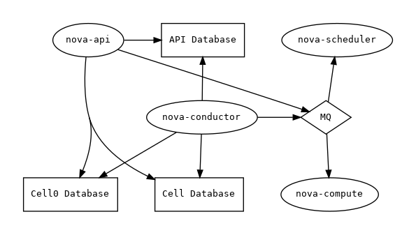
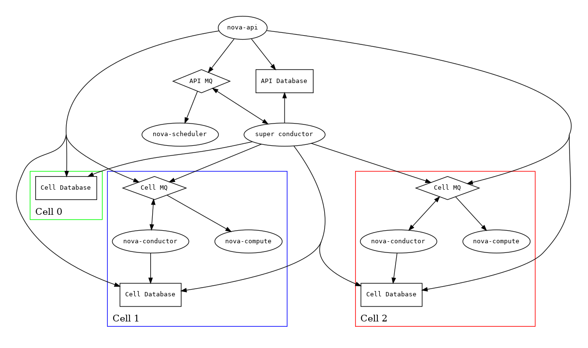
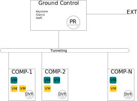
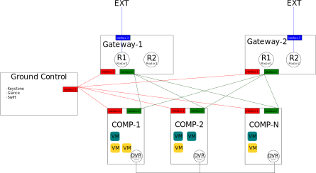
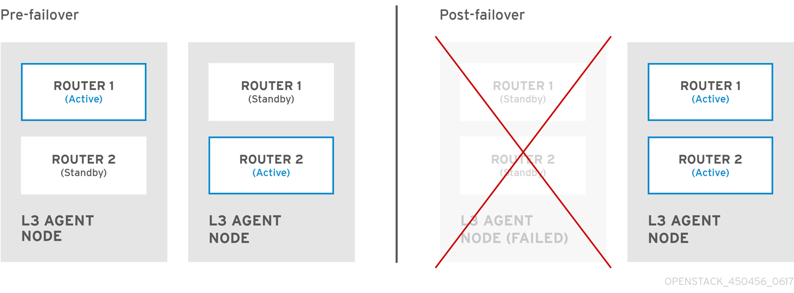

# Architecture

[//]: <> (**pré requis** : ML2-plugin, OpenvSwitch, VXLAN)

**Pour rappel** l'architecture, doit repondre aux objectifs selon `/doc/0_Intro/0_Presentation.md` : 
- KISS
- Security Focus

L'énoncé est orienté vers des déploiements de VM principalement. Autrement dit, l'architecture mettra en avant Les **Compute Node**.  
Un exemple typique : 
> un enseignant fait cours sur linux pour une classe, il est capable d'instancier 24 ubuntu en un clique et à la fin du cours supprimer toutes ces VM.

Une des propositions, non détaillé ici, serait d'utiliser seulement un seul et unique nœud OpenStack. Cette architecture serait grandement déprécié car elle n'est pas scalable et non performantes (raison détaillé plus tard).

**vocabulaire :**
- trafic Nord-Sud (VM vers EXT)
- trafic EST-OUEST (inter-NETWORK et intra-NETWORK) 

**Noeud :**
- *Controller node* : est un concepte simplifié. Dans la pratique, la HA est une obligation, qui consiste à toujours repliquer les noeuds pour faire face aux potentiels problemes de pannes ou maintenances. Le *control node* gère principalement les authentifications en continues, les messages queue, et accesoirement le dashboard. 
  - database : eneregistre toutes les informations concernant les utilisateurs et les instances. typiquement une database par services. (Possibilité de détaché la database du Control node pour chaque services).
  - message queue : tout les messages openstack sont reçus et envoyés via le queue broker
  - authentification : voir keystone
  - image management : stocke et enregistre les metadata concernant les images pour le lancement des VM
  - scheduling services : quelles ressources utiliser en premier. Gestion en fonction d'un algorithme.
  - user dahboard : voir horizon
  - API endpoint
- *Keystone node* : gestionnaire de `token` (agit comme un Active Directory ou Kerberos voir keystone). Authorise des tokens temporairements. Pour cela deux methodes UUID et Fernet (détails dans `/doc/1_OpenStack/1_Presentation_module`). Nous allons ici utiliser [Fernet](https://docs.openstack.org/keystone/pike/admin/identity-fernet-token-faq.html) pour l'avantage principal qu'il est scalable. Ainsi nous pouvons simplifier la distribution des clefs via `rsync` par ssh. La sécurité des jetons est garantie via plusieurs methodes cryptographiques.
- *Calcul node* : est un noeud destiné à l'execution des VM. Le module principal utilisé dessus est Nova. Les noeuds de calcul partage leurs ressources par un algoorithme afin de faire une utilisation optimal des ressources. Ces ordres de repartition de ressources sont gérée depuis le controller node par le module Placement.

- **ATTENTION** : Pour la *base de données*, il est préférable de la séparer du controller node, pour plusieurs raisons, pour ainsi les répliquer. Lors de mise à jour, il se peut que d'importante restructuration SQL soit tel qu'il y a une obligation de backup, de destruction, restructuration, repopulation, et insertion de données issue des backup, et redemarage du moteur SQL; Ce fut le cas lors du passage de Stein à Train avec l'extraction du module Placement. Ainsi la redondence de la base de données, permettra de faire toutes ces operations de manière invisible pour les utilisateurs. Il existe une possibilité de **créer une relation master/slave avec une database secondaire**. La slave database prend le relais si le temps de latence du master est supérieur 100ms. **L'écriture master/slave n'est pas instantanné, c'est la responsabilité de l'operateur**. La base sql peut utiliser MySQL, Postgre, ... La module python utilisé par défaut est SQLalchemy.

## Service Layout
Ici sont présenté l'architecture au sein des modules. Comment ils communiquent entre les différent sous modules.
### [Nova](https://docs.openstack.org/nova/ussuri/user/cellsv2-layout.html#service-layout)
#### Simple

Cette architecture s'applique pour un seul *compute node*.  Tout les services communiquent entre eux par le même message bus, et il n'y a qu'une seul database cell.  La database `cell0` est toujours présente et requise.
#### Multiple Cells

> *Remarque* l'architecture est similaire à la premiere, car en effet elle est une extension au niveau du *condutor*. 

Les messages bus sont séparé en fonction des cells. Le **super-conductor** à acces à l'API.  
**Important** les *cells* n'ont que la capacité de communiquer avec l'API `placement` (pour la gestion des ressources). Les cells n'ont pas la capacité de communiqué avec les autre couches API tels que API databse ou encore l'API de communication interne RPC.

## Solution : architecture DVR OpenvSwitch

L'architecture est composée de :
- 1 Controle-Node (ici appelé *Ground Control*) : il gère la majeur partie avec l'authentification, etc...
- N Compute-Node (ici appelé *COMP-#*) : où les VM seront exécutés.

### Connexion EST-OUEST
Cette architecture est scalable, le jour où la puissance de calcul n'est plus suffisante alors il suffira de déployer un nouveau Compute-Node.  
Chaque Compute-Node posséde un routeur (DVR). Si les DVR étaient absents alors tout les flux qu'ils soient Nord-Sud (VM vers EXT) ou EST-OUEST (inter-NETWORK et intra-NETWORK) passerait à travers le Principal Router (PR) ce qui alourdi la charge réseau. Les DVR (Distributed Virtual Routing) quand à eux sont là pour gérer les connexions EST-OUEST et ainsi le PR ne se concentre que sur les connexions NORD-SUD. Les DVR sont vu par OpenStack comme un seul routeur, ce qui permet que deux VM jaune (connecté aux network jaune) qui ne sont pas sur le même Compute-Node puissent interagir.

### Sécurité

Des FW sont mit en place sur :
- PR : ainsi protégé le trafics NORD-SUD et attaque extérieur
- DVR : (*rappel vu comme un seul routeur*) pour protégé les trafics EST-OUEST

Ainsi les règles de sécurité des FW sont centralisées et simplifiées. Étant donnés la simplicité, la configuration des règles FW respecteront le principe DRY (*Don't Repeate Yourself*). Ce qui permet une meilleur consistance des règles FW.

### Avantages

Premièrement il respecte les objectifs fixés. 
- KISS : modularité des nœuds de calcul, avec une scalabilité
- Security Focus : les règles de par feux sont centralisées sur le DVR et sur le PR. (avec la possibilité d'ajout des Security Group)
- High Availability : les connexions EST-OUEST sont allégé par les DVR
- Fault Tolerence : si un compute node cesse de fonctionné alors il n'impactera pas le reste

### Inconvénients

Majeur :
- High Availability : au niveau NORD-SUD les connexions seront ralentis car tout les flux des VM passeront par un seul routeur ici PR. Dans l'énoncé posé, ceci est un problème car les clients feront par exemple du bureau à distance, ou travaille de fichier (donc lourde charge). C'est un noeud d'étranglement.  

Mineur :
- Fault Tolerence : si Ground Control tombe en panne toute l'infrastructure tombe aussi car Keystone sera absent. Mais les connexions EST-OUEST fonctionneraient encore. Il suffirait de redéployer Ground Control à partir d'une snapshot fonctionnelle.
- Fault Tolerence : si un compute node meurt alors ses donnés sont perdu. Pour y remédier il suffit de faire du mirroring (duplication de donnés en temps réel) avec Cinder. Où faire des snapshot avec Swift toutes les intervallent de temps.

## Solution : L3 HA Gateway + DVR OVS

L'architecture est composée de :
- un centre de contrôle, ici appelé *Ground Control* : gère les authentifications et toutes autres tâches relatives à la gestion d'OpenStack
- plusieurs compute node, ici appelés *COMP-N* : sont des nodes dédiés à l'exécution des VM
- deux Gateway node, ici appelés *Gateway-N* : ont pour but de gérer toutes les connexions NORD-SUD.

### Connexion NORD-SUD

#### [VRRP](https://tools.ietf.org/html/rfc3768)
Le Virtual Routing Redundancy Protocol (VRRP) est un *first hop redundancy protocol* qui a pour but de garantir la HA aux niveaux des gateway.

**Les possibilités** qu'offre cette methode est l'allégement en divisant la charge du trafic par le nombre de routeurs en assignant une partie des IP à un routeur précis. C'est le load sharing.  

**Si l'un des routeurs perd la connectivité :** Premierement les routeurs possède des Virtual IP (VIP). Les routuers possèdes une VIP master. Les routeur fonctionnel envoie en continue un `hello` VRRP depuis leur VIP master aux autres routeurs.

Pour la configuration des VRRP avec des *gateway node* distincts du *controller node* suivre [cette doc archi L3HA VRRP](https://docs.openstack.org/liberty/networking-guide/scenario-l3ha-ovs.html)
